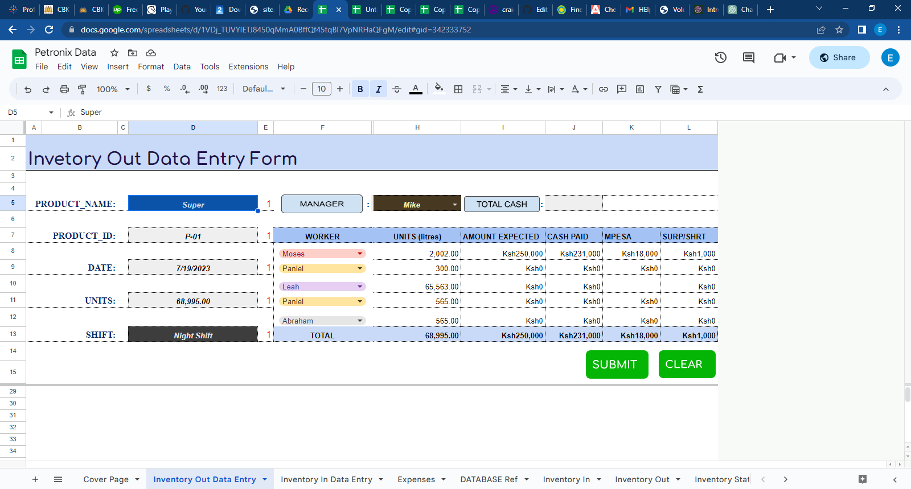
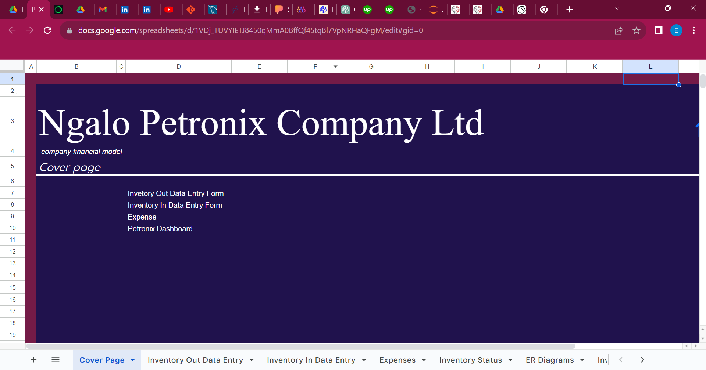
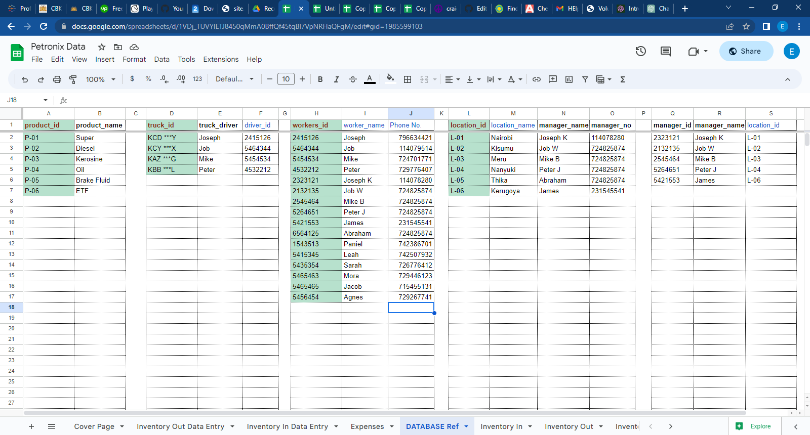
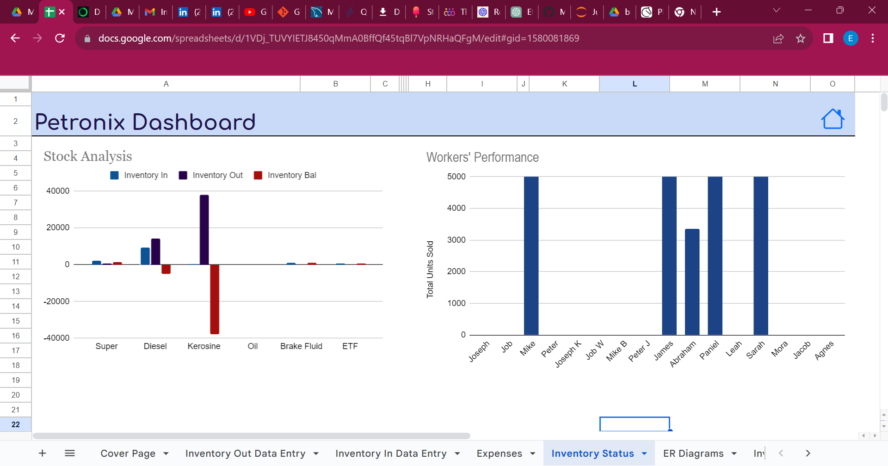

# [Control system management]( https://edutmp.github.io/Management-_system1/)

Inventory &amp; Expense control

***Introduction***

Welcome to the introduction of the Control Management System Development Project, a comprehensive 'software' solution designed to streamline and enhance control management processes. This project is an excellent addition to a developer's portfolio, showcasing your expertise in designing and implementing robust systems that improve operational efficiency and optimize decision-making.

 Model Overview 
***Raw data input***

***Problem Statement***

This problem statement addresses the need for implementing a Control Management System (CMS) within an oil company. The oil industry operates in a complex and highly regulated environment, with numerous risks and compliance requirements. The current manual and fragmented control management processes pose significant challenges in ensuring effective control implementation, monitoring, and reporting. Therefore, there is an urgent need to develop a CMS tailored to the unique needs of the oil company to enhance control efficiency, mitigate risks, and ensure compliance with industry regulations.
-Inefficient Control Implementation
-Inadequate Control Monitoring
-Compliance with Industry Regulations
-Lack of Integration and Data Integrity

***Cover page***
Efficiency Unleashed: Mastering System Management in the Digital Age

***Reference Diagrams***

This is an overview of the reference data.The following page was developed using the following functions: Vlookup & Xlookup. 
The above functions resulted to the following data ER diagrams. The Primary Keys are highlighted in red while the Foreign keys are highlighted in blue.

***Analysis***

Daily financial analysis in a business involves a systematic examination of the company's financial data on a day-to-day basis. It is a crucial practice that provides real-time insights into the financial health and performance of the organization. The process typically includes the following key activities:
- The first step involved collecting financial data from various sources, such as sales records, expenses, inventory, cash flow statements, and other relevant financial documents.
- Data Verification and Cleaning: The gathered data is thoroughly verified for accuracy and cleaned to ensure that any errors or inconsistencies are identified and rectified.
I used functions to automate the daily analysis.

In the preceding stages, extensive work was undertaken to gather and analyze the necessary data, with the ultimate aim of producing meaningful results. The initial phase involved meticulous data collection from various sources, such as sales, creditors, debtors,expenses and other operational metrics. Rigorous data cleaning and validation processes were employed to ensure the accuracy and integrity of the dataset.

## Recommendation

Develop a user-friendly website and consider online ordering for convenience store items or prepayment for fuel, making it easier for customers to plan their visits.
Offer a variety of payment options, including mobile payment apps, credit cards, and cash. Ensure that payment processing is fast and reliable.
mplement efficient inventory management systems to ensure fuel and convenience store items are always in stock. Use historical data to predict demand and order supplies accordingly to prevent stockouts.
